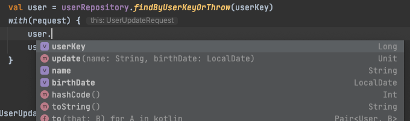
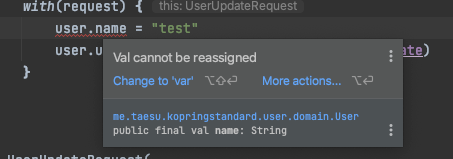
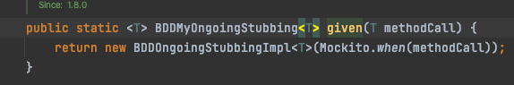
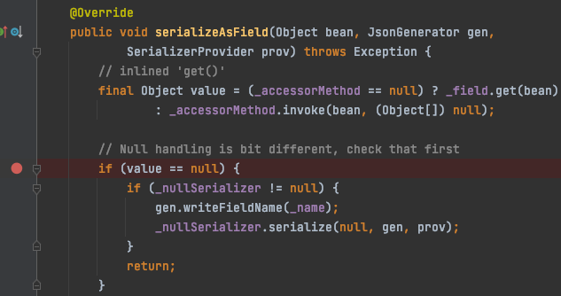
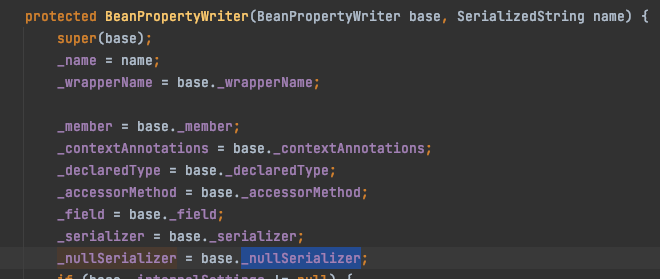
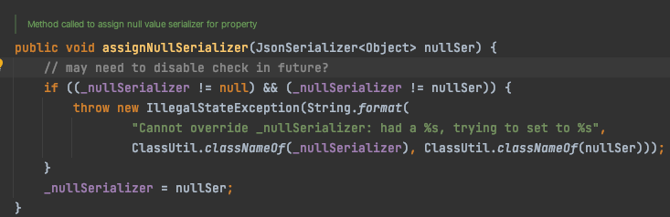

# Kotlin based Spring MVC project standard

Kotlin을 코드베이스로 하여 Spring 기반의 API 서비스를 개발 하면서 언어를 제대로 사용하고 있지 못하고 있다는 생각이 많이 들었다.   
Spring에서 Kotlin 지원을 위한 다양한 DSL을 전혀 이용하지 못했고 Repository에서 null을 반환하는지 체크하여 예외를 던지는 코드를  
매번 작성하는 등 확장함수를 적절히 사용하지 못했다.

Kotlin에서 제공하는 컨벤션에 따라 클래스 내에 선언 순서도 전혀 지키지 못했고 (companion object를 가장 상단에 선언 해버림)  
require나 check와 같은 함수의 존재를 몰라 사용하거나 응용하지 못했다.

프로젝트의 모델 중 일부 상속 개념이 있었는데 Sealed 클래스가 떠오르지 않아 Abstract 클래스를 이용했고  
when 구문에서 else 절을 두는 실수를 저질렀다. 나중에 새로운 자식 클래스가 추가 됐다면 예기치 못한 에러를 런타임에 만났을 수도 있다.  
Sealed 클래스로 설계 했다면 else 절을 두지 않았더도 됐을것이고 컴파일 시점에 에러를 만날 수 있었을 것이다.

테스트에 있어서도 모든 Mocking을 any, anyLong 등으로 해버리는 바람에 올바른 파라미터가 넘어가는 지에 대한 테스트가 누락됐고 실제 버그도 발생했다.  
그리고 테스트 코드를 작성하는 스타일도 BDDMockito를 활용하지 못했고 검증부에서도 Spring이 제공하는 DSL을 제대로 활용하지 못했다.

Spring Databind 부분에서도 조금 더 우아한 사용법을 찾아보았으면 좋았을 걸 하는 생각이 들었다.  
예를들어 Enum 타입의 바인딩을 위해 각 필드마다 하나하나 Serialize를 붙여주는 노가다를 했다.  
손도 많이가고 우아하지도 못했다.

```kotlin
enum class SupportLang {
    KO, EN, JA, ZH
}

class UserCreateRequest(
    @field:JsonSerialize(using = SupportLangSerializer::class)
    val language: SupportLang
)
```

Kotlin과 JPA(Hibernate)를 같이 사용 하면서 너무 코드 작성의 편의만 챙긴것이 아닌가 싶은 부분도 있다.   
예를들어 자바였다면 Entity에 대해 Setter를 선언하지 않도록 하여 외부에서 함부러 필드를 수정하지 못하게 했지만    
동일한 효과를 위해 Kotlin에서 protected set을 하나하나 선언해 주는것이 오히려 손이 더 많이간다고 생각했고 실제로 귀찮았다.  
그래서 protected set은 선언하지 않고 팀 내의 컨벤션으로 관리해서 코드리뷰 단계에서 필드를 외부에서 직접 수정하는 부분을 걸러내자라고 생각했다.  
이 부분도 조금 더 개선할 여지가 있지 않나 싶다.

이런저런 내용등을 토대로 프로젝트 진행시 아쉬웠던 점을 회고하면서 앞으로의 표준을 가다듬어보려고 한다.

## Kotlin

모든 코딩 컨벤션은 https://kotlinlang.org/docs/coding-conventions.html 링크를 따른다.

Effective Kotlin 책을 보면서 배운 내용을 아래 리파지토리에 정리하기로 한다.    
https://github.com/dlxotn216/effective-kotlin  
여기서는 이전 프로젝트 진행 시 아쉬웠던 점을 위주로 회고한다.

#### (1) 클래스 선언

https://kotlinlang.org/docs/coding-conventions.html#class-layout  
클래스 선언 규칙에서 아래의 순서를 따른다.

1. Property declarations and initializer blocks
2. Secondary constructors
3. Method declarations
4. Companion object

메서드의 순서는 알파벳 순서, 접근제어에 따른 순서, Override 여부에 따른 순서 등으로 절대 정렬하지 않는다.  
위에서 아래의 흐름으로 메서드가 사용되는 순서를 적절히 따르면 충분하다.  
중첩 클래스는 클래스에서 사용된다면 메서드의 뒤에 선언하고 외부에서 사용을 위한 것이라면 Companion Object 뒤에 선언한다.

#### (2) 가변성 제한과 불변성

Kotlin은 불변객체를 만들거나 프로퍼티 수정을 제한하는 것이 자바보다 더 잘 되어있다고 생각한다.  
특히 Data 클래스는 copy 메서드를 통해 손쉽게 객체 복제를 가능하게 해준다.

아래와 같은 html 태그들을 PDF로 출력 할 때 재귀적으로 랜더링을 하도록 하면 손쉽게 해결 할 수 있다.

```html
<p>
    <b style="font-size: 10px">테<i style="font-size: 12px">스<u>트</u> 문</i>서</b>
</p>
```

다만 부모 태그의 Font Size, Color, Font Family를 오염 없이 하위 컨텍스트로 전달 해줄까가 고민이었는데  
Data클래스를 통해서 잘 해결할 수 있었다.

```kotlin
fun getChildren(node: Node, renderingContext: me.taesu.kopringstandard.context.RenderingContext): List<Element> {
    val resolvedContext = renderingContext.copy(
        fontSize = resolveFont(node),
        color = resolveColor(node),
        fontStyles = resolveFontStyles(node, renderingContext)
    )

    return if (node.childNodeSize() == 0) {
        arrayListOf(nodeToPdfElements(node, resolvedContext))   // 재귀 호출이 일어나도 복제 된 resolvedContext가 전달 되므로 오염이 없다.
    } else if ((node.childNodeSize() == 1 && node.childNode(0) is TextNode)) {
        arrayListOf(nodeToPdfElements(node.childNode(0), resolvedContext))
    } else {
        node.childNodes().flatMap {
            getAllElement(it, resolvedContext)
        }
    }
}
```

Entity는 불변의 대상은 아니다. 그렇기에 가변성을 제한해주는 것이 좋다.  
하지만 protected set으로 선언 하는 것과 기본 값을 항상 넣어주어야 하는 점이 너무 불편해보였다.

아래 클래스의 경우 User 객체 생성 시 name에 대한 초기화를 빼먹을 수 있는 부분이 분명히 보인다.

```kotlin
@Table(name = "USR_USER")
@Entity(name = "User")
class User(
    @Id
    @GeneratedValue
    @Column(name = "USER_KEY")
    val userKey: Long,
) {
    @Column(name = "USER_NAME")
    var name: String = ""
        protected set
}
```

그래서 아래와 같이 생성자에 선언을 하고 protected set으로 외부에서 직접적인 필드 수정을 강제적으로 막지는 않고 코드리뷰 선에서 막도록 컨벤션을 두었다.

```kotlin
@Table(name = "USR_USER")
@Entity(name = "User")
class User(
    @Id
    @GeneratedValue
    @Column(name = "USER_KEY")
    val userKey: Long,

    @Column(name = "USER_NAME")
    var name: String = "",

    @Column(name = "BIRTH_DATE")
    var birthDate: LocalDate
) {
    fun update(name: String, birthDate: LocalDate) {
        this.name = name
        this.birthDate = birthDate
    }
}
```

하지만 프로젝트는 나 혼자하는 것도 아니고 언제까지나 내가 계속 코드리뷰를 하고 있을 수 없고 protected set이 없다면  
나중에 귀찮던 누군가 혹은 구조를 잘 모르는 누군가는 외부에서 필드를 직접 수정하는 코드를 짜고 코드리뷰도 통과해버려서  
프로젝트가 잘못된 방향으로 흘러갈 수 있다는 생각이 들었다.  
항상 나는 "API를 설계할 때 사용하는 사람이 실수를 덜 할 수 있는 방향으로 해야한다" 라는 원칙을 두고 구현을 하는데 클래스 설계에도 적용하는게 맞지 않나 싶다.

우아한 테크 세미나를 보던 중 화면에 나온 예제 코드를 참고 해봤다.

```kotlin
@Table(name = "USR_USER")
@Entity(name = "User")
class User(
    @Id
    @GeneratedValue
    @Column(name = "USER_KEY")
    val key: Long,

    @Embedded
    private val userInfo: UserInfo
) {
    val name: String get() = userInfo.name
    val birthDate: LocalDate get() = userInfo.birthDate

    constructor(userKey: Long = 0, name: String, birthDate: LocalDate):
        this(userKey, userInfo = UserInfo(name, birthDate))

    fun update(name: String, birthDate: LocalDate) {
        this.userInfo.update(name, birthDate)
    }
}

@Embeddable
class UserInfo(
    @Column(name = "USER_NAME")
    var name: String,

    @Column(name = "BIRTH_DATE")
    var birthDate: LocalDate,
): Serializable {
    fun update(name: String, birthDate: LocalDate) {
        this.name = name
        this.birthDate = birthDate
    }
}
```

UserInfo라는 Embeddable 클래스를 두어서 Entity의 생성자로 받게 하는 법이다.  
userInfo는 private 필드로 선언해서 외부에서 직접적으로 접근하여 필드 수정을 방지하고  
필드에 대한 수정은 Entity의 메서드가 받아서 Embedded 객체에 위임 하면 된다.

외부에서 보이는 필드는 모두 getter 뿐이다.  




#### (3) 확장함수 활용

아래와 같이 key로 Entity를 찾는 메서드 호출시 매번 elvis 연산자를 통해 예외를 던지는 코드를 짰다.

```kotlin
interface UserRepository: CrudRepository<User, Long> {
    fun findByUserKey(userKey: Long): User?
}

class SomeService(private val userRepository: UserRepository)

fun someMethod(userKey: Long) {
    val user = userRepository.findByUserKey(userKey) ?: throw NoSuchElementException("User[$userKey]")
}
```

이보단 아래와 같은 확장함수를 만들어 썼으면 더 좋았을 것 같다.

```kotlin
interface UserRepository: CrudRepository<User, Long> {
    fun findByUserKey(userKey: Long): User?
}

fun UserRepository.findByKeyOrThrow(userKey: Long): User {
    return findByUserKey(userKey) ?: throw NoSuchElementException("User[$userKey]")
}
```

아래와 같이 공통 Repository를 만들고 확장함수를 정의 해두면 더 좋을 듯.  
(다만 userKey에서 key로 공통화를 위해 프로퍼티 이름이 바뀌어야 한다.)

```kotlin
@NoRepositoryBean
interface KeyBasedRepository<T, Long>: JpaRepository<T, Long> {
    fun findByKey(key: Long): T?
}

fun <T> KeyBasedRepository<T, Long>.findByKeyOrThrow(key: Long): T {
    return findByKey(key) ?: throw NoSuchElementException("Entity[$key]")
}

interface UserRepository: KeyBasedRepository<User, Long>
```

## Testing

#### (1) BDDMockito 사용 (UserExceptionServiceTest.kt)

이전 프로젝트에서 잘 사용 했는데 신규 프로젝트에선 제대로 사용하지 못했다.  
이번 기회에 Mockito와 BDDMockito의 차이점을 정리해보려고 한다.

Mockito Style

```kotlin
  // given
doReturn(user).`when`(userRepository).findByKey(12L)
`when`(userRepository.findByKey(12L)).thenReturn(user)
```

doReturn().when()과 when().thenReturn의 차이점은 타입 검증에 있다.

```kotlin
doReturn(123).`when`(userRepository).findByKey(12L)
```

doReturn은 위처럼 해도 컴파일 시점에 시점에 오류가 안난다.  
실제 테스트를 돌렸을 때 런타임에 오류가 난다. 그래서 Mockito를 사용할거라면 when().thenReturn()을 쓰는게 더 좋다고 생각한다.

단, when().thenReturn()은 실제 메서드 호출이 일어난다는 점을 주의해야 한다. doReturn().when()은 메서드 호출이 일어나지 않는다.  
void 리턴 타입에 대해선 doNothing().when()을 사용하면 된다.

BDDMockito Style

```kotlin
  // given
given(userRepository.findByKey(12L)).willReturn(user)
willDoNothing().given(service).update()
```

둘다 동작은 동일하지만 BDDMockito를 사용하는 편이 더 좋다고 생각한다.  
willReturn에서 타입이 지정되어있어 컴파일 시점에 타입 오류를 미리 알 수 있어 좋다.

내부적으로 Mockito.when을 호출하므로 when().thenReturn()과 마찬가지로 실제 메서드 호출이 일어난다.  
그렇기에 실제 동작과 다른 given 조건을 설정할 일도 줄어들것이라고 생각한다.  


서술하는 흐름도 given ~ will return 이런식으로 흘러가니 given-when-then에 좀 더 부합하는 것 같아 좋다.  
되도록 BDDMockito Style로 통일하되 필요시에만 Mockito 스타일을 따르면 될 것 같다.

#### (2) 파라미터에 대한 검증

```kotlin
  // given
doReturn(UserRetrieveResponse()).`when`.(service).retrieve(anyLong())

// when
val mvcRequest = MockMvcRequestBuilders.get("/api/v3/studies/1/users/1")
    .accept(MediaType.APPLICATION_JSON)
    .contentType(MediaType.APPLICATION_JSON)

// then ...
```

이 테스트는 아래의 컨트롤러가 제대로 파라미터를 넘기는지 전혀 검증 못한다.

```kotlin
class UserRetrieveController(private val userRetrieveService: UserRetrieveService) {
    @GetMapping("/api/v1/studies/{studyKey}/users/{userKey}")
    fun retrieve(
        @PathVariable("studyKey") studyKey: Long,
        @PathVariable("userKey") userKey: Long,
    ) {
        userRetrieveService.retrieve(studyKey) // 잘못된 파라미터를 넘기고 있음
        // ...
    }
}
```

그래서 이런식으로 stub을 채우는게 더 바람직하다고 생각한다.

```kotlin
 // 실제 넘어가리라 예상하는 파라미터를 넣는다.  
// 다른 값이 서비스에 전달되면 null이 리턴 되어 테스트가 제대로 동작하지 않는다.  
given(userRetrieveService.retrieve(12L)).willReturn(
    UserRetrieveResponse(
        key = 12L,
        email = "taesu@crscube.co.kr",
        name = "Lee",
        birthDate = LocalDate.of(1993, 2, 16)
    )
)
```

단 any와 혼용해야 할 경우 eq()로 파라미터 stub을 넣으면 된다.  
eq로 감싸지 않으면 에러난다.

```kotlin
given(userRetrieveService.retrieve(eq((12L)), anyString())).willReturn(
    UserRetrieveResponse(
        key = 12L,
        email = "taesu@crscube.co.kr",
        name = "Lee",
        birthDate = LocalDate.of(1993, 2, 16)
    )
)
```

eq로만 stub을 채우면 어떨까?  
-> 마찬가지로 예외가 발생한다.

```kotlin
given(
    userRetrieveService.retrieve(
        ArgumentMatchers.eq(12L),
        ArgumentMatchers.eq("taesu@crscube.co.kr")
    )
).willReturn(
    UserRetrieveResponse(
        key = 12L,
        email = "taesu@crscube.co.kr",
        name = "Lee",
        birthDate = LocalDate.of(1993, 2, 16)
    )
)
```

## Spring 전반

#### (1) Code값 처리

리스트를 응답으로 내보내거나 하면 코드값과 다국어화 된 라벨을 내려줘야 하는 경우가 많다.  
이번 프로젝트에서 Code 데이터를 DB화 하지 않고 Application 내부에서 갖게 했고 다국어는 Message Properties를 이용했다.  
응답으로는 코드값만 내려주고 Front에서 다국어로 보여주게끔 해두었는데 생각보다 까다로웠는지 버그가 많이났다.  
그래서 Code에 대한 응답 DTO를 만들고 Jackson에서 Serializer를 통해 다국어를 바인딩 해주면 좋지 않을까 싶다.

아래와 같이 CodeEnum 인터페이스와 그에 대응하는 JsonSerializer를 구현한다.

```kotlin
@JsonSerialize(using = CodeEnumSerializer::class)
interface CodeEnum {
    val codeId: String
    val name: String
    val messageId: String get() = "CODE.$codeId.$name"
}

class CodeEnumSerializer(private val messageSource: MessageSource): JsonSerializer<CodeEnum?>() {
    // 객체화 해도 되지만 굳이 오버헤드를 가져가지 않아도 될듯
    override fun serialize(code: CodeEnum?, generator: JsonGenerator, provider: SerializerProvider) {
        generator.writeStartObject()
        generator.writeStringField("value", code?.name ?: "")
        val label = code?.let {
            messageSource.getMessage(it.messageId, emptyArray<Any>(), LocaleContextHolder.getLocale())
        } ?: ""
        generator.writeStringField("label", label)
        generator.writeEndObject()
    }
}
```

아래의 UserType Enum은 사용 예제이다.  
코드 값은 enum의 name을 사용한다고 가정하고 codeId는 Kotlin의 Default Argument를 이용한다.
```kotlin
enum class UserType(override val codeId: String = "USER_TYPE"): CodeEnum {
    BRONZE,
    SILVER,
    GOLD,
    PLATINUM,
    DIAMOND,
    ;
}

class UserPaginatedRow(
    val userKey: Long,
    val email: String,
    val name: String,
    val birthDate: LocalDate,
    val userType: UserType
)
```

UserType Enum이 실제 Serialize 된 결관느 아래와 같다.  
코드값 처리에 대해 별도 로직 필요 없이 Message Properties에 규칙에 따른 프로퍼티만 존재하면 알아서 다국어가 번역 되니 편리할 것 같다.
```json
{
  "content": [
    {
      "userKey": 1,
      "email": "taesu@crscube.co.kr",
      "name": "Lee Tae Su",
      "birthDate": "1993-02-16",
      "userType": {
        "value": "DIAMOND",
        "label": "다이아몬드"
      }
    }
  ],
  "pageable": "INSTANCE",
  "totalElements": 1,
  "totalPages": 1,
  "last": true,
  "size": 1,
  "number": 0,
  "numberOfElements": 1,
  "sort": {
    "sorted": false,
    "empty": true,
    "unsorted": true
  },
  "first": true,
  "empty": false
}
```

(2) Null Code값 처리 만약 enum 필드가 null일 때는 아래와 같이 응답이 나간다.

```json
{
  "userKey": 1,
  "email": "taesu@crscube.co.kr",
  "name": "Lee Tae Su",
  "birthDate": "1993-02-16",
  "userType": null
}
```

CodeEnumSerializer가 사용된다면 null 대신 빈 객체로 응답이 나가야 하지만 그렇지 않다.  
왜 그런지 디버깅을 해보면 아래의 com.fasterxml.jackson.databind.BeanPropertyWriter#serializeAsField 메서드를 보면 알 수 있다.     


일단 값이 null이고 _nullSerializer가 존재하면 Serialize 처리를 위임한다.  
_nullSerializer를 설정해주기 위해 아래와 같이 nullUsing 속성을 지정하면 될 듯 하지만  
인터페이스, 클래스 수준에 적용한 nullUsing은 원하는대로 동작하지 않는다.

```kotlin
@JsonSerialize(using = CodeEnumSerializer::class, nullUsing = CodeEnumSerializer::class)
interface CodeEnum {
    val codeId: String
    val name: String
    val messageId: String get() = "CODE.$codeId.$name"
}
```

아래와 같이 필드 수준에 적용해야 제대로 동작 한다.

```kotlin
class UserPaginatedRow(
    val userKey: Long,
    val email: String,
    val name: String,
    val birthDate: LocalDate,
    @JsonSerialize(using = CodeEnumSerializer::class, nullUsing = CodeEnumSerializer::class)
    val userType: UserType
)
```

아마도 인터페이스, 클래스 레벨의 NullSerializer < 아래 캡쳐의 base의 NullSerializer < 필드 레벨의 NullSerializer의 우선순위를 갖기 때문인 것 같다.  


모든 필드에 적용하는 경우 누락되는 케이스가 발생할일이 많으므로 최대한 인터페이스, 클래스 수준에 적용하는 것이 좋을 것이다.  
그러기 위해서 설정으로 풀기보다는 아래와 같이 assignNullSerializer를 우리가 원하는 타이밍에 호출 해주는 것이 가장 확실한 방법일 것 같았다.     


https://tousu.in/qa/?qa=1033058 글을 통해서 Jackson 모듈 설정을 통해서 원하는 설정을 추가하는 방법을 참고 했다.

```kotlin
@Configuration
class AppConfig: WebMvcConfigurer {
    @Bean
    fun codeEnumModule() = CodeEnumModule()
}
class CodeEnumModule: Module() {
    override fun version(): Version = Version.unknownVersion()
    override fun getModuleName() = "CodeEnum"
    override fun setupModule(context: SetupContext) {
        context.addBeanSerializerModifier(CustomBeanSerializerModifier())
    }
}
class CustomBeanSerializerModifier: BeanSerializerModifier() {
    override fun changeProperties(
        config: SerializationConfig,
        beanDesc: BeanDescription, beanProperties: List<BeanPropertyWriter>
    ): List<BeanPropertyWriter> {
        val codeEnumNullSerializer = CodeEnumNullSerializer()
        return beanProperties.apply {
            filter { CodeEnum::class.java.isAssignableFrom(it.type.rawClass) }
                .forEach { it.assignNullSerializer(codeEnumNullSerializer) }
        }
    }
}
```

##### 참고

(1) Jackson의 Module 추상 클래스를 구현하는 CodeEnumModule을 Bean으로 선언해주면 Jackson에서 ObjectMapper를 설정하면서 모듈을 알아서 등록 함  
(2) CustomBeanSerializerModifier는 객체가 Serializer될 때 호출이 되어 원하는 시점에 CodeEnumNullSerializer를 Assign 할 수 있음    
(3) CodeEnum 인터페이스의 하위 Enum 클래스인 경우 모두 CodeEnumNullSerializer를 Assign 해줘야 하므로 isAssignableFrom 메서드를 사용  
(4) CodeEnumModule Bean은 WebMvcConfigurer를 상속하는 Configuration 클래스에 등록 해주어야 함.

```kotlin
@Configuration
class JacksonConfig {
    @Bean
    fun codeEnumModule() = CodeEnumModule()
}
```

Jackson2ObjectMapperBuilder는 WebMvcConfigurer 설정에서 실행되어 모듈들을 찾아 등록하기 때문에  
위와같이 별도의 일반 Configuration 클래스에 Bean을 등록하면 모듈이 알아서 등록되지 않음.  
  

## 연관된 글
<ul>
<li>
<a href="https://medium.com/@taesulee93/spring-webmvc%EC%97%90%EC%84%9C-jackson-custom-serdes-serializer-deserializer-%EC%9D%84-%ED%99%9C%EC%9A%A9%ED%95%98%EC%97%AC-enum-%EB%98%91%EB%98%91%ED%95%98%EA%B2%8C-%EC%82%AC%EC%9A%A9%ED%95%98%EA%B8%B0-with-jackson-9ee9af9f563c">Spring WebMVC에서 Jackson Custom SerDes¹을 활용하여 Enum 똑똑하게 사용하기 (with Jackson module)</a>
</li>
<li>
<a href="https://medium.com/@taesulee93/https://medium.com/@taesulee93/spring-webmvc%EC%97%90%EC%84%9C-custom-converter%EB%A5%BC-%ED%99%9C%EC%9A%A9%ED%95%98%EC%97%AC-enum-%EB%98%91%EB%98%91%ED%95%98%EA%B2%8C-%EC%82%AC%EC%9A%A9%ED%95%98%EA%B8%B0-81ddbc94c759">Spring WebMVC에서 Custom Converter를 활용하여 Enum 똑똑하게 사용하기</a>
</li>
<li>
<a href="https://medium.com/@taesulee93/kotlin%EC%9D%84-%EC%9D%B4%EC%9A%A9%ED%95%98%EC%97%AC-spring-jdbctemplate-%EC%BF%BC%EB%A6%AC-%EA%B2%B0%EA%B3%BC-%EC%86%90%EC%89%BD%EA%B2%8C-%EA%B0%80%EC%A0%B8%EC%98%A4%EA%B8%B0-9a11fe6f158b">Kotlin을 이용하여 Spring JdbcTemplate 쿼리 결과 손쉽게 가져오기</a>
</li>
</ul>
